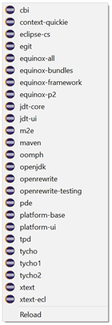
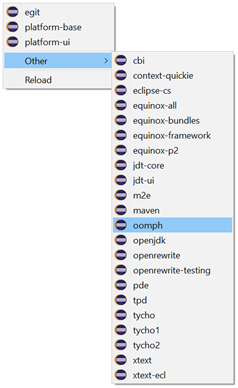

# Eclipse Launcher
AutoHotkey based quick launcher for many eclipse installations. Add this to your startup folder, and invoke it via Ctrl-Win-E. Opens a context menu at your current mouse position to launch all installed Eclipse IDEs.

# Installation

* Make sure your machine has [AutoHotkey](https://www.autohotkey.com/) installed.
* Use Win-R to open the _Run_ menu.
* Enter `shell:startup`, which will open your personal startup folder.
* Paste the `eclipse-launcher.ahk` file into that folder. That way, it will be executed on each Windows start.
* To immediately start it now, double-click the `eclipse-launcher.ahk`.

# Configuration

* Set the `RootFolder` directory to the directory that contains your different eclipse installations.
* If you have too many installations, you can restrict what is shown on the top level menu by changing the `TopLevelPattern` variable. All other installations will be moved to a sub menu then.
* Unwanted installations can be filtered via the `IgnorePattern`.

# Troubleshooting

The menu is only created once, immediately after starting the script, to avoid excessive disk access. After installation of yet another Eclipse IDE, you may want to use the _Reload_ menu item to have the script discover that new installation.